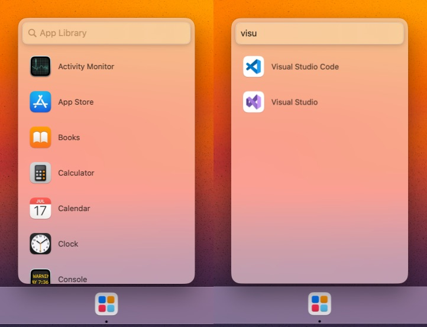

# App Library
A lightweight app launcher for macOS.

Launchpad hasn't recieved any significant updates (or love) from Apple since it was released with Mac OS X Lion in 2011.  App Library aims to fix that oversight.

## Features
- [x] Launch apps
- [x] Search installed apps
- [x] Hide and show apps in the library with a (right) click
- [x] Add and remove search scopes to look for installed apps
- [ ] Keyboard navigation
- [ ] Grid view
- [ ] Group by app category

## Installation
App Library requires macOS 13.0 or later.\
Download and unzip the latest `App Library.app.zip` [release](https://github.com/ryanslikesocool/AppLibrary/releases/latest).\
Move the app to your Applications folder (and your dock!)

## Known Issues
- App Library cannot be sandboxed due to the way it uses accessibility features to locate the dock icon.
- When the dock is on the right side of the screen, the spacing between the dock and App Launcher is a little wider.  It's possible to fix with a few magic numbers but this is really Apple's fault.

## Acknowledgements
[Mouse Finder](https://github.com/neilsardesai/Mouse-Finder) - Dock icon location code
