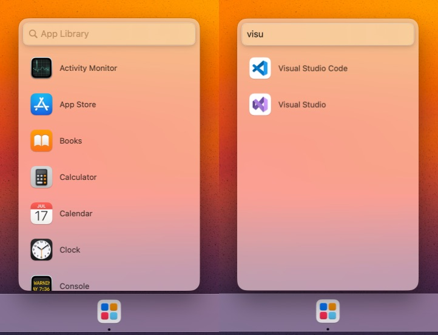

# App Library
A lightweight app launcher for macOS.

Launchpad hasn't received any significant updates or love from Apple since it was released with Mac OS X Lion in 2011.
App Library aims to fix that oversight.

## Features
- [x] Launch installed apps
- [x] Search installed apps
- [x] Hide installed apps in the library
- [x] Add custom search scopes to look for installed apps
- [ ] Keyboard navigation
- [ ] Grid view
- [ ] Grouping

## Installation
App Library requires macOS 14.0 or later.
 
Download and unzip the latest `App Library.app.zip` [release]( https://github.com/ryanslikesocool/AppLibrary/releases/latest ).
 
Move the app to your Applications folder (and your dock!)

## Known Issues
- Apps that may have multiple installations, such as Unity, are not currently supported.
- App Library cannot be completely sandboxed due to the way it uses accessibility features to locate the dock icon.
	- Note: This is *partially* remedied using a helper application.
